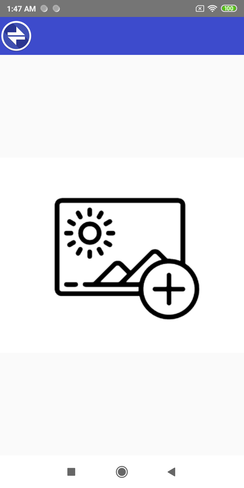
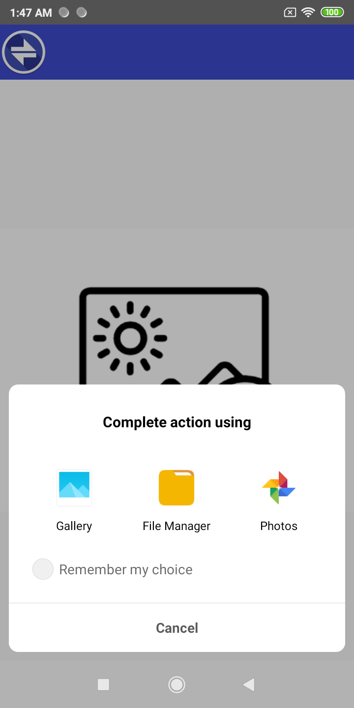
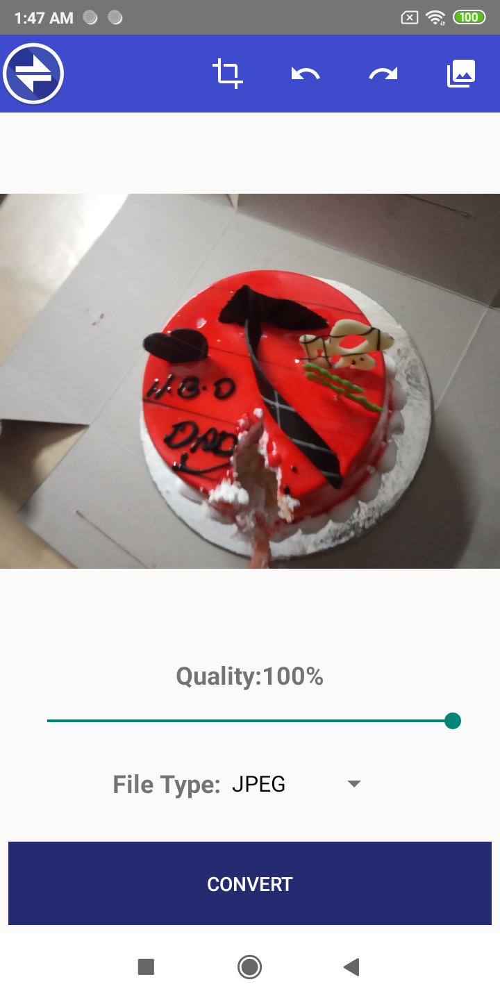
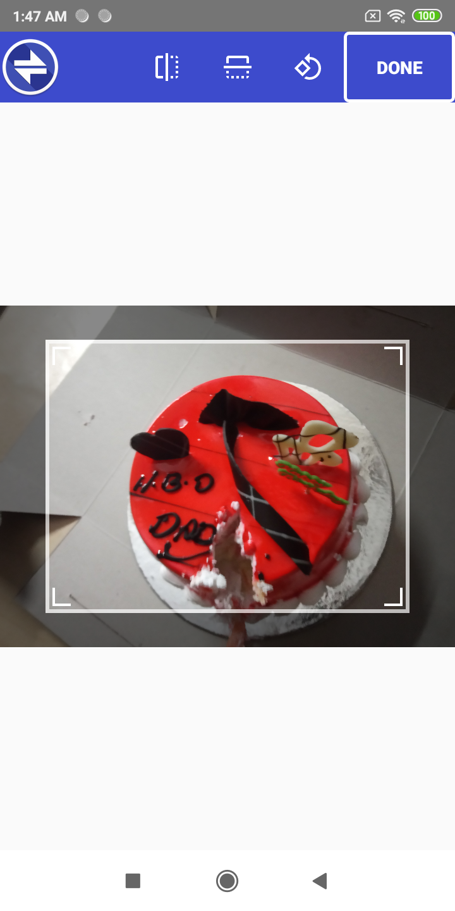
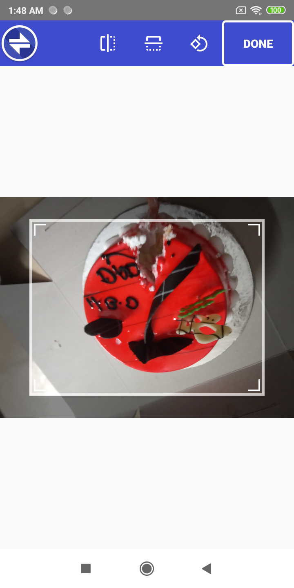
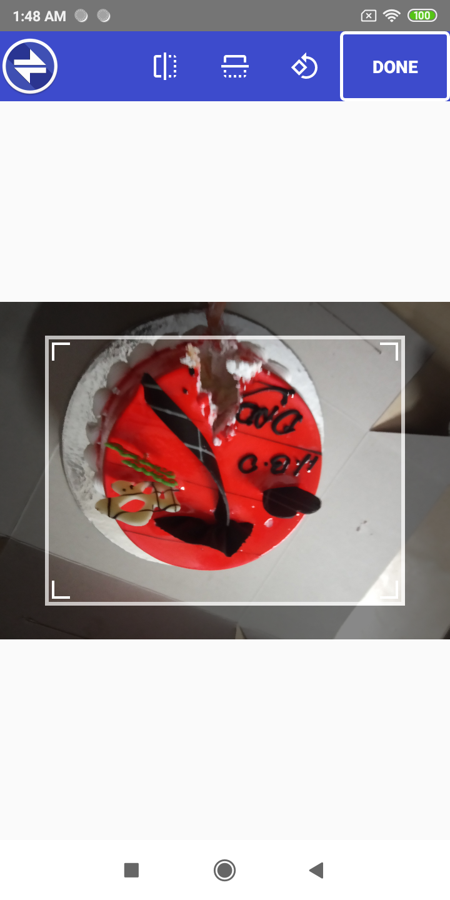
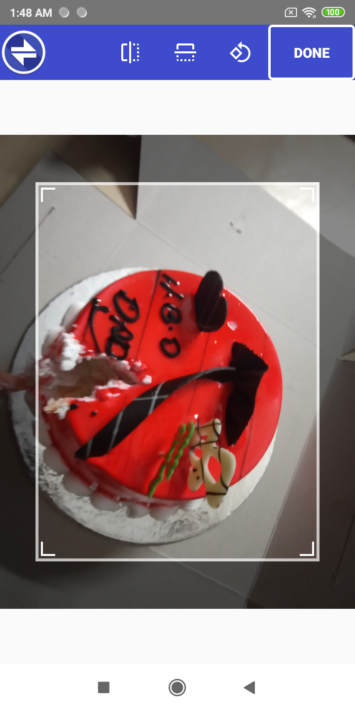
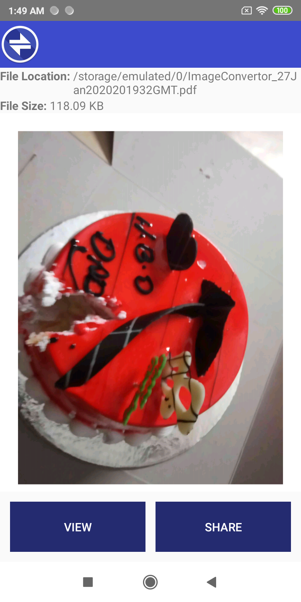
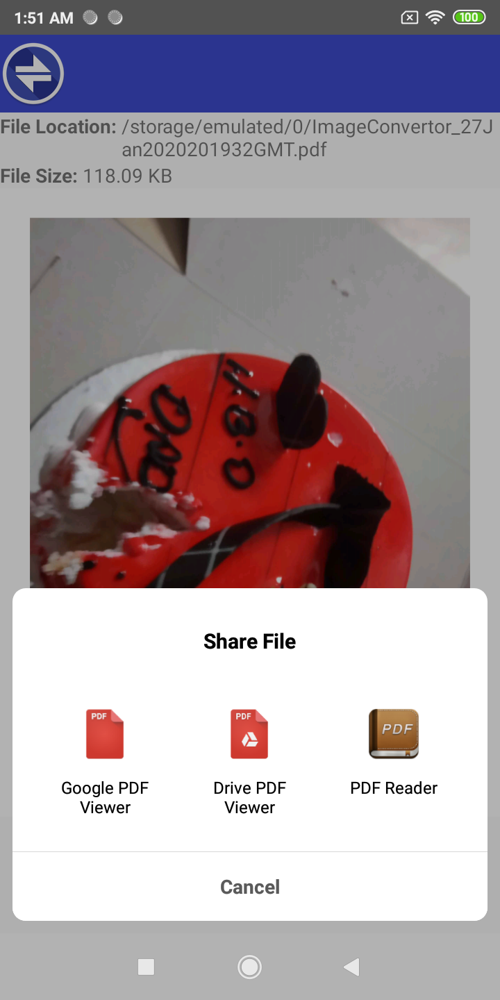

# ImageConvertor

Convert your image to JPG from a variety of formats including PDF. More advanced features like visual cropping, resizing or applying filters. Just select your format you want to convert to, upload your image file and optionally select filters. Your image will be converted instantly and you can view or share the result with anyone.

Image Convertor formats:
1. JPEG
2. PDF
3. WEBP
4. PDF
    

    

    

    

